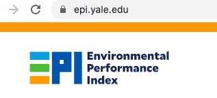
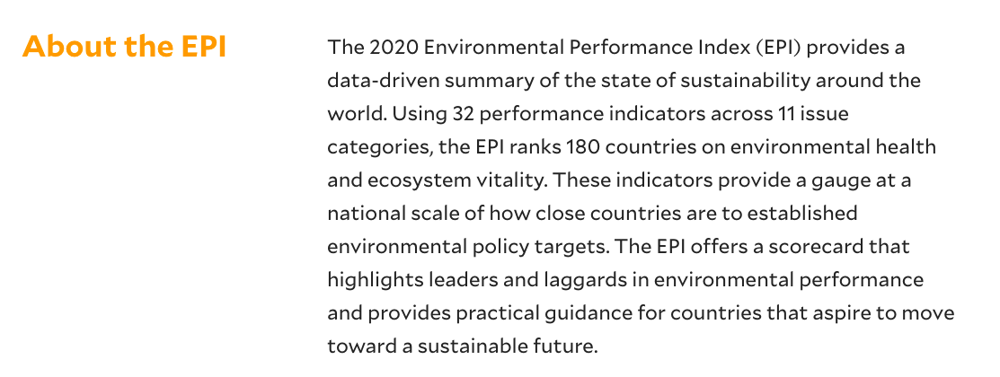

```{r xaringan-themer, include=FALSE, warning=FALSE}
library(xaringanthemer)
style_mono_light(
  base_color = "#042856", 
  header_color = "#7cacd4",
  title_slide_text_color = "#7cacd4",
  link_color = "#0000FF",
  text_color = "#000000",
  background_color = "#FFFFFF",
  header_h1_font_size ="2.00rem"
  )
```

```{r xaringan-scribble, echo=FALSE}
xaringanExtra::use_scribble() #activate for the pencil
xaringanExtra::use_xaringan_extra(c("tile_view", "animate_css", "tachyons"))
xaringanExtra::use_panelset() #panel set
```


```{r, echo=FALSE, purl=FALSE, message = FALSE}
knitr::opts_chunk$set(comment = "#>", purl = FALSE, fig.showtext = TRUE, retina = 2)
```

class: left

# Outline

* What is `Tidyverse Ecosystem`?
* `Pipe` operator.
* `Tibbles` alternative to `data frames`.
* Data importing via `readr` and `readxl` packages.
  * 01-importing.Rmd
* Data manipulating with `dplyr` package.
  * 02-manipulating.Rmd
* Data tidying with `tidyr` package.
  * 03-tidying.Rmd
  
---
class: middle, center

```{r echo=FALSE, results='asis', out.width='90%', fig.cap=''}
  
```

---
```{css echo=FALSE}
.pull-left {
  float: left;
  width: 50%;
}
.pull-right {
  float: right;
  width: 50%;
}
```

.pull-left[
<blockquote class="twitter-tweet"><p lang="en" dir="ltr">Most data scientists spend almost 80% of their time inspecting and cleaning data rather than working on their machine learning models.<br><br>But why?</p>&mdash; Ammar Yasser (@ammaryh92) <a href="https://twitter.com/ammaryh92/status/1449261043138584578?ref_src=twsrc%5Etfw">October 16, 2021</a></blockquote> <script async src="https://platform.twitter.com/widgets.js" charset="utf-8"></script>
]


.pull-right[
- "According to the "No Free Lunch theorem", most machine learning models have a set of built-in assumptions, and before you start training your model, you have to make sure that your data is in line with the underlying assumptions of your model."
- "Data analysis allows you to:
  1. Understand the patterns and trends in the data.
  2. Understand the data distribution.
  3. Make sure that your data is in line with the model's assumptions.
  4. Assess the quality of the data (noise, wrong values, missing values, outliers, etc).
  5. Assess the tidiness of the data (data structure, variable types, etc.)
  6. Clean your data to get it in the best possible form for your model.
  7. Feature engineering (extract features with predictive power from data)."

- "So make sure to spend some time analyzing and cleaning your model before moving on to your model. Always remember, "Garbage in, Garbage out".


]
---
class: center, middle

.pull-left[
```{r echo=FALSE, results='asis', out.width='90%', fig.cap=''}
  
```
]

.pull-right[
```{r echo=FALSE, results='asis', out.width='90%', fig.cap=''}
  
```
]

[Dezyre](https://www.dezyre.com/article/why-data-preparation-is-an-important-part-of-data-science/242)


---
class: center, middle

<!-- First code block is setting options for theme of the slides  -->  
<!-- Second code block is setting global options R code blocks --> 

# Introduction to Tidyverse Ecosystem

                  

---

# What is the Tidyverse Ecosystem?

- [Tidyverse](https://www.tidyverse.org/) is **a collection of packages** built as a suite of "data science" tools with a focus on **importing, manipulating**, and **visualizing data**.


```{r echo=FALSE, results='asis', out.width='80%', fig.show='hold', fig.cap=''}
knitr::include_graphics('images/data-science-workflow.png')
```

---
- There are about 30 packages in the `Tidyverse ecosystem`. 
- The **core** `Tidyverse ecosystem` includes the following packages:
  - `tibble`: alternative to data.frame class,
  - `readr`: open and organize the data,
  - `dplyr`: data manipulation,
  - `tidyr`: modeling and data management,
  - `ggplot2`: data visualization,
  - `forcats`: functions for working with factors, 
  - `stringr`: functions for working with string data,
  - `purrr`: code optimization and functional programming, and
  -  also, by default includes `magrittr` (source of the `pipe operator`). 
 

.pull-right[
```{r echo=FALSE, results='asis', out.width='70%', fig.cap=''}
  
```
]


---
- All these packages are designed to **work well together** and are based on: 
  - **tidy data** philosophy, where each variable has its own column, each observation has its own row,
  - use **pipe operator** `%>%` to improve code development and readability, and
  - follow a **common functional structure** for code clarity and reproducibility. 
- Please visit [Tidyverse Style Guide](https://style.tidyverse.org/), especially the one on [Syntax](https://style.tidyverse.org/syntax.html).
    
 
---
# Install the Tidyverse Ecosystem

- We can install **everything at once** and access the `Tidyverse` as follows:

```{r eval=FALSE}
# Install "tidyverse" package on your local machine.
# You only need to do this once per machine.
install.packages("tidyverse", dependencies = TRUE)
# By default, install.packages() will download packages from 
# https://cran.r-project.org, or one of its mirrors—so be sure you 
# are connected to the internet when you run it.
```

- This will install the following packages:

```{r eval=FALSE}
[1] "broom"         "cli"           "crayon"        "dbplyr"        "dplyr"        
[6] "dtplyr"        "forcats"       "googledrive"   "googlesheets4" "ggplot2"      
[11] "haven"         "hms"           "httr"          "jsonlite"      "lubridate"    
[16] "magrittr"      "modelr"        "pillar"        "purrr"         "readr"        
[21] "readxl"        "reprex"        "rlang"         "rstudioapi"    "rvest"        
[26] "stringr"       "tibble"        "tidyr"         "xml2"          "tidyverse" 
```

---
- Now we can load package `tidyverse` into our `R` session.

```{r eval=TRUE}
# You need to do this each time you start a new R session.
# You may need to update the packages (with update.packages() .
# function) from to time to time to get the latest improvements.
library(tidyverse)
```

---
# What about those conflicts?
- When `R` loads packages, functions loaded in earlier packages are **overwritten** 
  by functions of the **same name** from later packages. 
- This means that **the order in which packages are loaded** matters. 
- We can see that there are two functions in the `dplyr` package which *mask* base-`R` functions of the **same name**.
- To make sure that a  function from  the correct package is used, we can use the following construction:

```{r eval=FALSE}
package_name::function_name()
```

- where the double colon operator `::` is the **namespace operator**. 
- So if we want to access the base functions instead of the `tidy` ones, we should **explicitly** refer to specific functions with **namespace operator** such as :

```{r eval=FALSE}
base::filter()
```
- As a general rule, it is better to load the `tidyverse` *after* all other packages; this will identify the conflicts.

---
# Example

```{r}
library(tidyverse)
library(MASS)
#implies that you cannot use select function in dplyr package
```

```{r, eval=FALSE}
# but if you want to use select function in dplyr package, # use this
dplyr::select()
# or you can also use this
library(tidyverse)
library(MASS, exclude = 'select')
```

---

💡 Also notice that `library(tidyverse)` does not load every package installed by `install.packages("tidyverse")`. 

💡 We must use `library()` function to individually load the **non-core** `tidyverse` packages.


---
# Tidy Data

- **Tidy data** assumes that:
  - Each variable forms a column,
  - Each observation forms a row, and
  - Each type of observational unit forms a table.
  
```{r echo=FALSE, results='asis', out.width='70%', fig.cap=''}
  
```  

---

class: center, middle

```{r echo=FALSE, out.width='50%', fig.cap=''}
  
```


---
# The pipe operator `%>%`

- The pipe operator `%>%` is a **special operator** introduced in the `magrittr` package:
  - allows us to “pipe” several functions into **one long chain** that matches the order in which we want to do stuff and, 
  - in this sense, takes the object/function call result on the left and "passes" it to the right; it does *not* make assignment by itself. 


```{r}
# in standard R
x <- 1:3
sum(x)
```

```{r}
# with the pipe, we can rewrite this as:
x <- 1:3
# with the pipe  
x %>% 
  sum()
```

---

# Usage

- The pipe operator `%>%` should always have a space before it, and should usually be followed by a **new line**.
- After the first step, **each line** should be **indented by two spaces**.
- If the arguments to a function do **not all fit on one line**, put each argument **on its own** line and indent.

---
- Root mean squared error (RMSE) is defined: 

$$
\text{RMSE} = \sqrt\frac{\sum_{i=1}^n(\hat{y}_i-y_i)^2}{n}
$$
where $\hat{y}_i$ denotes the prediction and $y_i$ the actually observed value.

```{r}
# in standard R
data <- c(1, 3, 4, 2, 5)
prediction <- c(1, 2, 2, 1, 4)
# calculate root mean squared error
rmse <- sqrt(mean((prediction-data)^2))
print(rmse)
```

---
- Using the pipe operator `%>%` makes the operation more intuitive: 

```{r}
data <- c(1, 3, 4, 2, 5)
prediction <- c(1, 2, 2, 1, 4)

# calculate root mean squared error the pipe way 
rmse <- (prediction-data)^2 %>% 
         mean() %>% 
         sqrt() %>% 
         print() 
```

---
class: center, middle

```{r echo=FALSE, out.width='30%', fig.cap=''}
  
```
---
# What is a Tibble?

- The `Tidyverse ecosystem` uses **tibbles** as an **alternative** to the `R`'s base `data.frame` class. 
- [Tibbles](https://tibble.tidyverse.org/) are intended to represent the `tidy` data principles by design and provides opinionated data frames that make working in the `tidyverse` a little easier.
- `Tibbles` and `data frames` have many similar properties (rectangular data), but
`tibbles` returns more **readable output** in the console.
- We can create `tibbles` with `tibble()` function.


---
# Example

```{r}
# Create a tibble
# tibble() builds columns sequentially. 
# When defining a column, you can refer to columns created earlier in the call.
mytibb <- tibble(
          "x" = 1:3, 
          "y" = 4:6, 
          "z" = x ^ 2 + y,
          "t" = c("math", "stat", "cs")
          )
mytibb
class(mytibb)
```

---
# Getting Help

💡 We can get **help on a package** by typing `package?packagename` such as:

```{r}
package?tibble
```

💡 We can get **help on a specific function** within that package by typing `?packagename::functionname` such as:

```{r}
?tibble::tibble
```

---
- We can **coerce** a `data.frame` to a `tibble` and **coerce** a `tibble` easily back to a `data.frame` as well.

```{r} 
head(iris)
class(iris)
```
---

```{r} 
as_tibble(iris)
```
---
# Tibbles vs. data.frame
- There are **two main differences** in the usage of a tibble vs. a classic data.frame: **printing** and **subsetting**.
  - `Tibbles` have a refined print method that **shows only the first 10 rows**, and all the columns that fit on screen.
 -  In `Tibbles`, each column reports **its type**, a nice feature borrowed from `str()`.


---
- We can explicitly `print()` the `Tibbles` and control the number of rows (n) and the width of the display. 

```{r}
# coerce iris data set into a tibble
iris_tibble <- as_tibble(iris)
```

```{r} 
# `n` specifies the number of rows
# `width = Inf` will display all columns:
#  i do not have enough space, so i set n = 15
iris_tibble %>% 
  print(n = 15, width = Inf)
```

---
- Another option is to use `RStudio’s` **built-in data viewer** to get a scrollable view of the complete dataset. 

```{r, eval=FALSE} 
# run this on R console
iris_tibble %>% 
  View()
```
---
- We can pull out a single variable by `$` and `[[ ]]`.  
  - `$` only extracts by **name** and
  - `[[ ]]` can extract by **name** or **position**.

```{r, eval=F} 
# run this on R console
# Extract by column name
iris_tibble$Petal.Width
# Extract by column name
iris_tibble[["Petal.Width"]]
# Extract by position
iris_tibble[[4]]
```
---
 - To use these in a pipe, we need to use the **special placeholder** `.` :
```{r, eval=F} 
# run this on R console
iris_tibble %>% .$Petal.Width
iris_tibble %>% .[["Petal.Width"]]
```

- Use `as.data.frame()` to turn a tibble back to a data.frame:
 
```{r}  
class(as.data.frame(iris_tibble))
```

---
# Data Importing
- One of the most commons ways of **storing and sharing data** for analysis is through **electronic spreadsheets**. 
- A spreadsheet stores data in **rows** and **columns** and it is basically a **file version** of a **data frame**. 
- When saving such a table to a computer file one needs a way to define when a new row or column ends and the other begins. This in turn defines the cells in which single values are stored. 
- Sometimes the first row contains **column names** rather than data. 
- We call this a **header** and when reading data from a spreadsheet it is important to know if the file has a header or not. 
- **Most reading functions assume there is a header**. 
- To know if the file has a header, it helps to look at the file before trying to read it. 
- In `RStudio` we can do this by navigating to the file location, double clicking on the file and hitting _View File_.
- We start by demonstrating how to **read in a file** that is already **saved on your computer**.  

---
class: center, middle

```{r echo=FALSE, out.width='30%', fig.cap=''}
knitr::include_graphics('logo/readr.png')  
```

---
# The readr package

- The [readr](https://readr.tidyverse.org/) is the `tidyverse` package that includes functions for **reading rectangular data** (spreadsheets like 'text', 'csv') into `R`. 
- The `readr` package can be loaded directly:

```{r}
library(readr)  
```

- The following functions are available to read-in spreadsheets:

| Function       | Format                       | Typical suffix          |
|----------------|------------------------------|-------------------------| 
| `read_table()` | white space separated values | txt |
| `read_delim()` | general text file format, must define delimiter | txt |
| `read_csv()`   | comma separated values|  csv |
| `read_csv2()`  | semicolon separated values | csv |
| `read_tsv()`   | tab delimited separated values | tsv |
| `read_lines()` | reads up to n_max lines from a file | - |


---

💡 We can get help on a package by typing `package?readr` and get help on a specific function
within that package by typing: `?readr::read_csv`.

```{r}
# let's get some help
?readr::read_csv
# focus on the arguments: file, col_names, skip, n_max
```

- More details on [Tidyverse readr](https://readr.tidyverse.org/).

---
class: center, middle

```{r echo=FALSE, out.width='30%', fig.cap=''}
knitr::include_graphics('logo/readxl.png')  
```

---
# The readxl package

- The [readxl](https://readxl.tidyverse.org/) package provides functions to read in **Microsoft Excel** spreadsheets.
- The `readxl` package does not come with `tidyverse`. For that reason, we need to install `readxl` package and then load it.

```{r, eval=FALSE}
# install readxl
install.packages("readxl")
```
```{r}
# load readxl
library(readxl)
```


| Function        | Format                  | Typical suffix |
|-----------------|-------------------------|-----------------| 
| `read_excel()`  | auto detect the format  | xls, xlsx|
| `read_xls()`    | original format         | xls |
| `read_xlsx()`   | new format              | xlsx |

---

💡 We can get help on a package by typing `package?readxl` and get help on a specific function
within that package by typing `?readxl::read_xlsx`.

```{r}
# let's get some help
?readxl::read_excel
# focus on the arguments: file, sheet, col_names, skip
```


- More details on [Tidyverse readxl](https://readxl.tidyverse.org/).

---

```{css echo=FALSE}
.pull-left {
  float: left;
  width: 50%;
}
.pull-right {
  float: right;
  width: 50%;
}
```

.pull-left[
```{r echo=FALSE, results='asis', out.height='50%', out.width='80%', fig.cap=''}
  
```
]
--
.pull-right[
```{r echo=FALSE, results='asis', out.height='100%', out.width='100%', fig.cap=''}
  
```
]

--
- Please walk around https://epi.yale.edu/.

---

```{r echo=FALSE, results='asis', out.height='100%', out.width='90%', fig.cap=''}
 
```
--

- Please walk around hhttps://www.google.com/covid19/mobility/.

---

```{r echo=FALSE, results='asis', out.height='100%', out.width='90%', fig.cap=''}
 
```
--

- Please walk around https://transmonee.org/.

---
- **Hands-on example:** Visit `01-importing.Rmd` file.

---
class: center, middle

```{r echo=FALSE, out.width='30%', fig.cap=''}
knitr::include_graphics('logo/dplyr.jpeg')  
```

---
# The dplyr package
- The [dplyr](https://dplyr.tidyverse.org/) package is one part of a larger `tidyverse` ecosystem that enables us to work with data in tidy data formats. 
- Here are basic `dplyr` functions:


| Function       |  Description                                       | 
|----------------|----------------------------------------------------|
| `filter()`     | pick observations by their values (chooses rows)   | 
| `select()`     | pick variables by column names (selects columns)   | 
| `arrange()`    | sort rows by variables                             | 
| `mutate()`     | create new variables with functions of existing variables | 
| `summarise()`  | collapse many values down to a single summary |

---
# filter()
- The [filter()](https://dplyr.tidyverse.org/reference/filter.html) function is used to **subset the rows** of `data` based on the conditions applied to the column values to determine which rows should be retained.
- The first argument to this function is the data
frame and the subsequent arguments are **comparison operators** applied to the columns.
- It supports **unquoting** in variable names.
- Multiple conditions can be applied via **Boolean operators**.
- More details on [filter()](https://dplyr.tidyverse.org/reference/filter.html).

---

- Remember the comparison and Boolean operators.

```{r echo=FALSE, out.width='90%', fig.cap=''}
 
  
```

---
# select()

- The [select()](https://dplyr.tidyverse.org/reference/select.html) (and optionally `rename()`) select variables in a data frame based on their **column name**.
- The first argument to this function is the data
frame and the subsequent arguments are the **columns to keep**.
- Variable names are quoted (or **unquoted**) expression separated by commas.
- The `select()` keeps only the variable you mention.
- We can also treat variable names like they are **positions** so that we can use expressions like `x:y` to select range of
variables.
- The `rename()` keeps all the variables.
- It is worth knowing that `dplyr` comes with a number of [select helpers](https://www.rdocumentation.org/packages/dplyr/versions/0.7.2/topics/select_helpers), which are functions that allow us to select columns based on their names. 
- More details on [select()](https://dplyr.tidyverse.org/reference/select.html).

---
# arrange()
- The [arrange()](https://dplyr.tidyverse.org/reference/arrange.html) **orders the rows** of a data frame by the values of selected columns. 
- The first argument to this function is the data
frame and the subsequent arguments are comma separated list of unquoted variable names, or expressions involving variable names.
- To sort from highest to lowest value or from Z to A, add `desc()` to `arrange()`
- More details on [arrange()](https://dplyr.tidyverse.org/reference/arrange.html).

---
# mutate()
- The [mutate()](https://dplyr.tidyverse.org/reference/mutate.html) **creates new columns** based on the values in existing columns and preserves existing ones.
- The new and edited columns will not permanently be added to the existing data frame -- unless we explicitly save the output.
- New variables overwrite existing variables of the same name.
- The `transmute()` adds new variables and drops existing ones.
- More details on [mutate()](https://dplyr.tidyverse.org/reference/mutate.html).

---
# case_when()
- The `case_when()` allows us to vectorize **multiple** `if_else()` statements.
- It is `R` equivalent of the `SQL CASE WHEN` statement.
- A sequence of two-sided two sided formulas. LHS determines which values match this case. RHS provides the replacement values. 

---
# summarise()
- The [summarise()](https://dplyr.tidyverse.org/reference/summarise.html) summarizes one or more variables in data
frame.
- Summarizing should be done with an expression that returns a single value like `min()`,
`max()`, `n()`, `sum()`.
- To use the function we just add our new column name, 
 and after the equal sign the mathematics of what needs to happen, column_name = function(variable).  
- More info [summarise()](https://dplyr.tidyverse.org/reference/summarise.html).
 
| Explanation  | Function              | 
|--------------|-----------------------|
| Center       | `mean()`, `median()`  | 
| Spread       | `var()`, `sd()`       | 
| Range        | `min()`, `max()`       | 
| Position     | `first()`, `last()`, `nth()`|
| Count        | `n()`, `n_distinct()`|
| the number of observations | `n()` |
| the numbers of unique values of the variable | `n_distinct()`|  

- You can add multiple summary functions behind each other.  

---
# group_by()
- In most cases, we want to get summaries by a group.
- The `group_by()` is often used together with `summarize()` which takes the column names as arguments that contain the **categorical** variables for which you want
to calculate the summary statistics.
- We can also group by multiple columns.
- More details on [summarise()](https://dplyr.tidyverse.org/reference/summarise.html).

---

- **Hands-on example:** Visit `02-manipulating.Rmd` file.

- **Study by yourself**: https://www.riinu.me/2020/02/r-filtering-with-na-values/.

---

class: center, middle

```{r echo=FALSE, out.width='30%', fig.cap=''}
knitr::include_graphics('logo/tidyr.png')  
```

---
# The tidyr package

- [tidyr](https://tidyr.tidyverse.org/) describes a standard way of storing data that is used wherever possible throughout the `Tidyverse ecosystem`.
- Tidy data is data where: 
   - Every column is variable.
   - Every row is an observation.
   - Every cell is a single value.

- Here are basic `tidyr` functions:

| Function          |  Description                           | 
|-------------------|----------------------------------------|
| `pivot_longer()` |lengthens data, increasing the number of rows and decreasing the number of columns|
| `pivot_wider()`  |The inverse transformation of pivot_longer() |
| `drop_na()`      |drops rows containing missing values | 
| `replace_na()`   |replaces NAs with specified values |  

- More details on [tidyr](https://tidyr.tidyverse.org/).
---


```{r echo=FALSE, out.width='90%', fig.cap=''}
knitr::include_graphics('images/wilddata.jpeg')  
```

- **Hands-on example:** Visit `03-tidying.Rmd` file.

---
# Exporting data 

- Similar to the `read_csv()` function used for reading CSV files into `R`, there is a `write_csv()` function that generates CSV files from data frames.

```{r, purl=FALSE, eval=FALSE}
write_csv(mytidydata, "data_output/mytidydata.csv", row.names = F)
```

- By default, `write_csv()` includes a **column with row names** (in our case
these names are the row numbers), so we need to add `row.names = FALSE` so
they are not included.    

---

# Attributions
- More on data types [Data types](https://r-coder.com/data-types-r/).
- All images used in this slide are taken from the web.
- This lecture note is mainly developed by following sources:
   - [McMasterl](https://socialsciences.mcmaster.ca/jfox/Courses/R/ICPSR/tidy_lecture-slides.pdf), 
   - [Stat Duke](http://www2.stat.duke.edu/~cr173/Sta112_Fa16/data_wrangling.html),
   - [Tidyverse](https://www.tidyverse.org/),
   - [Psych252](https://psych252.github.io/psych252book/data-wrangling-1.html),
   - [R4ds](https://r4ds.had.co.nz/tibbles.html),
   - [Data Science Labs](https://datasciencelabs.github.io/pages/lectures.html) and
   - [Cengel](https://github.com/cengel/R-data-wrangling).


